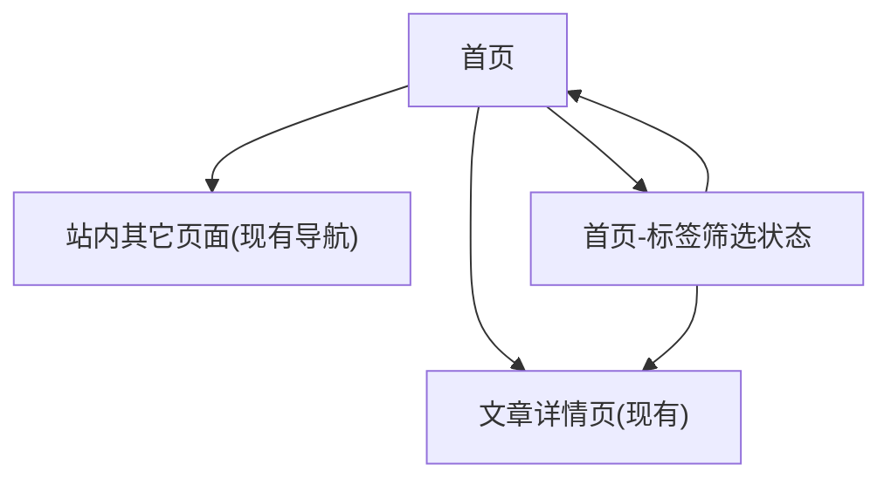

## 1. Product Overview
在不改变现有信息结构与数据来源的前提下，对网站首页进行极简美观的视觉与布局改版，并加入少量低成本交互提升可用性与质感。
面向所有访客，目标是更快浏览最新/重点文章，并通过标签云更直达内容。

## 2. Core Features

### 2.1 User Roles
本次首页改版不引入角色差异，所有访客体验一致。

### 2.2 Feature Module
本次需求仅涉及以下页面：
1. **首页**：顶部导航（兼容现有）、首屏与站点简介、文章列表（兼容现有）、标签云（兼容现有）、少量交互（筛选/动效/滚动）。

### 2.3 Page Details
| Page Name | Module Name | Feature description |
|-----------|-------------|---------------------|
| 首页 | 兼容性约束 | 保持现有顶部导航信息架构与跳转不变（链接、层级、文案可不改）；不改变文章列表与标签云的数据字段/接口约定与基础 DOM 语义（如需重排，优先“包裹层+样式”方式）；不新增必须后端支持的能力。 |
| 首页 | 顶部导航区 | 复用现有导航结构；提供当前页高亮/悬停态；在滚动时保持轻量吸顶（可关闭或在移动端降级）。 |
| 首页 | 首屏（Hero） | 展示站点名称/一句话定位；提供 1 个主按钮（如“查看最新文章”）锚点跳转到文章区；整体留白、对比明确。 |
| 首页 | 文章列表区 | 按现有逻辑展示文章列表；提供“标签筛选”联动（点击标签后仅筛选当前列表展示，支持一键清除）；保持文章卡片点击进入详情页的现有行为与 URL 不变。 |
| 首页 | 标签云区 | 按现有标签云输出渲染；点击标签触发列表筛选并在标签云上显示选中态；提供“清除筛选”。 |
| 首页 | 少量交互与动效 | 为卡片/按钮/标签提供轻量 hover/press 状态；锚点平滑滚动；列表进入视口的淡入（需可降级，不影响性能）。 |
| 首页 | 可访问性与性能 | 保持键盘可达（Tab 顺序清晰，焦点可见）；对比度达标；图片懒加载（若现有已做则不重复）；动画遵循 prefers-reduced-motion。 |

## 3. Core Process
- 访客进入首页：看到顶部导航与首屏信息，决定向下浏览或直接点击首屏按钮跳转到文章列表。
- 浏览文章：在文章列表中滚动浏览，点击文章卡片进入文章详情（沿用现有页面与链接）。
- 使用标签：在标签云点击某一标签，文章列表即时筛选；再次点击同一标签或点击“清除筛选”恢复全部列表。
- 导航跳转：访客可随时使用顶部导航进入站内其它页面（完全兼容现有导航结构与路由）。

